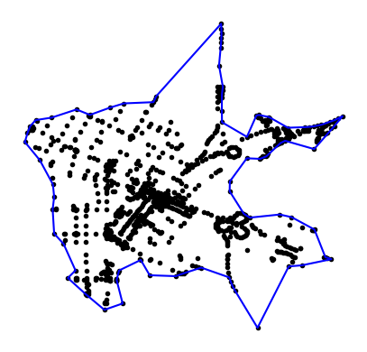

# cdBoundary

<!-- WARNING: THIS FILE WAS AUTOGENERATED! DO NOT EDIT! -->

A very fast 2.5D **concave hull** algorithm by distance implemented in
Python.

Rather than using a factor between 0 and 1 as most *Concave Hull* or
*Alpha Shape* algorithms this implementation uses *maximum edge length*
(`tol`) as a paramater.

The library was needed specific for *survey* or *LiDAR* data for
engineering applications.

## Install

``` sh
git clone https://github.com/civildot/cdBoundary
cd cdBoundary
python setup.py install
```

## Usage

### 1. As a library

The points should be in list format with coordinate pairs:  
`[[x1, y1], [x2, y2], [x3, y3], ...]` or  
`[[x1, y1, z1], [x2, y2, z2], [x3, y3, z3], ...]`

All edge lengths exceeding `tol` parameter will be attempted to be
removed. This parameter’s unit will thus be the same as your
coordinates. Wether it is meters, feet or degrees.

The `../examples/points-1k.json` dataset was borrowed with thanks from
[concaveman](https://github.com/mapbox/concaveman).

``` python
import json
from cdBoundary.boundary import ConcaveHull

ch = ConcaveHull()
with open('../examples/points-1k.json') as source:
    pts = json.load(source)
ch.loadpoints(pts)
ch.calculatehull(tol=0.0025)
```

The result is a `shapely` Polygon at `ch.hull`.

``` python
print('Geometry type:', ch.hull.geom_type)
coords = ch.boundary_points()
print()
print('The first 5 coordinates of the concave hull is:')
for i in range(5):
    print(i+1, '.', coords[i], sep='')
```

    Geometry type: Polygon

    The first 5 coordinates of the concave hull is:
    1.(-122.08441, 37.384634)
    2.(-122.0832, 37.383161)
    3.(-122.08214, 37.3812)
    4.(-122.08204, 37.380184)
    5.(-122.08216, 37.379173)

``` python
ch.plot()
```



If there is an uncertianty on which value to use for `tol` the
`estimate` function can be used to provide an estimate. The default
percentile `perc` is 92.5%. At this value only outside border edges
longer than 92.5% of all the edges will be attempted to be removed.

``` python
print('There is', len(coords), 'vertices on the current polygon.')
print('The suggested value to use is', round(ch.estimate(), 10))
ch.calculatehull(tol=ch.estimate())
print()
print('There is', len(ch.boundary_points()), 'vertices on the new polygon.')
```

    There is 83 vertices on the current polygon.
    The suggested value to use is 0.0017366632

    There is 164 vertices on the new polygon.

The low value for the `estimate()` *(much smaller than 1)* suggest that
the coordinates are in degress. When working in feet or meters it will
be much larger.

``` python
ch.plot()
```


### 2. Working directly with files

[Fiona](https://github.com/Toblerity/Fiona) is used to read point data
directly from files. The resulting `Polygon` can also be written to the
file format supported by `Fiona`.

``` python
from cdBoundary.fileio import FileIO

fch = FileIO()
fch.file2points('../examples/Bandelierkop_survey.shp')
fch.write2file(tol=35)
```

In the same folder as your input file there is now a file named
`concave_hull.shp` *(default)* containing the concave hull as a polygon.

or

``` python
with open('../examples/points-1k.json') as source:
    pts = json.load(source)
fch = FileIO()
fch.loadpoints(pts)
fch.calculatehull(tol=ch.estimate())
fch.write2file(outfile='../examples/concave_hull2.shp', driver='ESRI Shapefile')
```

## Documentation

[https://civildot.github.io/cdBoundary](https://civildot.github.io/cdBoundary/)

## Requirements / Dependencies

- [shapely](https://github.com/shapely/shapely)
- [matplotlib](https://github.com/matplotlib/matplotlib)
- [numpy](https://github.com/numpy/numpy)
- [Fiona](https://github.com/Toblerity/Fiona) \>= 1.9.4

## Algorithm

This concave hull implementation is based on the algorithm developed by
Duckham et al. (2008) in the paper “Efficient generation of simple
polygons for characterizing the shape of a set of points in the plane”,
available [here](http://www.geosensor.net/papers/duckham08.PR.pdf).

## Wish list

Possible features or enhancements in the future. Nothing planned. The
library is already satisfactory for our speicific application.

- ~~Plot output for quick visualization~~ *Implemented 15 July 2023*
- ~~Support an elevation (Z value) on the polygon vertices~~
  *Implemented 15 July 2023*
- Support for holes
- cli (Command Line Interface)
- Provide as a QGIS Plugin
- Implement it as a [Streamlit](https://github.com/streamlit)
  application

## Similar Implementations

A lot of *concave-hull* and *alpha-shape* implementations on Github, but
very few using maximum edge length as an argument.

1.  The greatest influence on *cdBoundary* is
    **<http://www.rotefabrik.free.fr/concave_hull>** which can be
    accessed through the [OpenJUMP](http://www.openjump.org/) user
    interface.
2.  The `lasboundary` command line program from
    **[LASTools](https://lastools.github.io/)** is unfortunately
    proprierity but also edge length as an argument and is very
    powerful.
3.  MacRoad, later
    **[HighRoad](http://www.interstudio.net/highroade.html)**, an
    ancient road design and earthworks program. Still being used today
    but no longer actively maintained. It has a `Join Edge Points`
    function which is a concave hull implementation already implemented
    in 1988. It has an `estimate` button which inspired the `estimate`
    function for cdBoundary.
4.  **[jtsop](https://github.com/locationtech/jts/blob/master/doc/JTSOp.md)**
    from the *JTS* (Java Topology Suite) has got a
    `Construction.concaveHullByLen` function as well.
